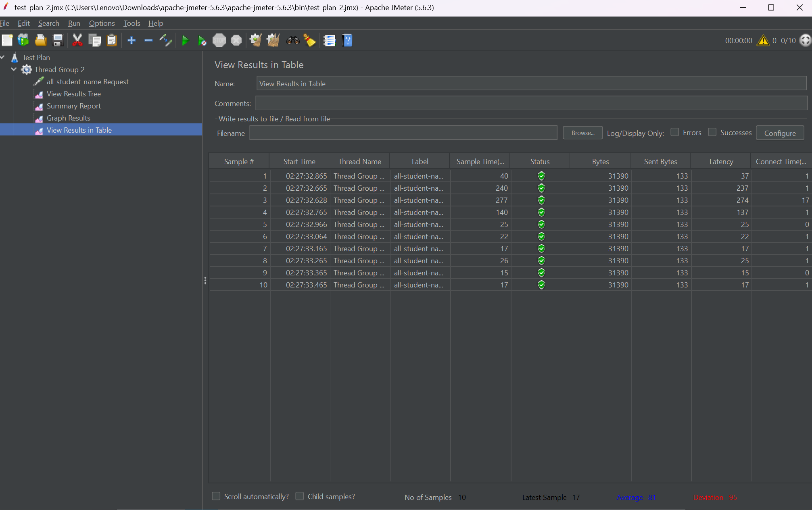
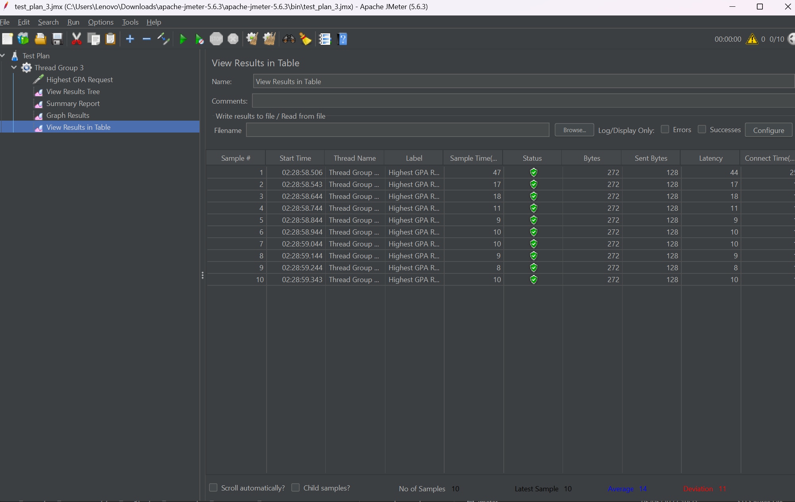
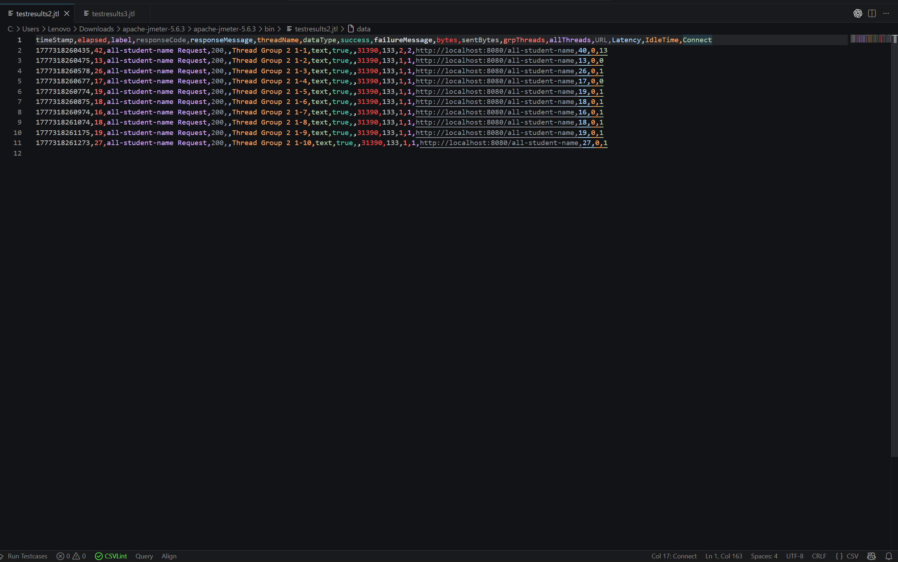
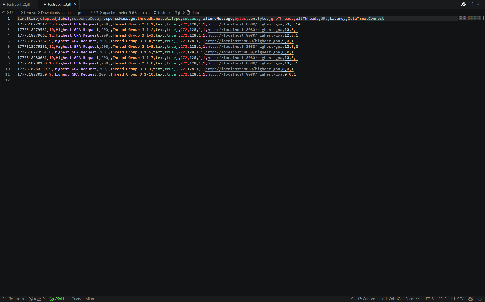
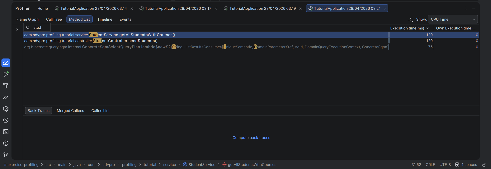
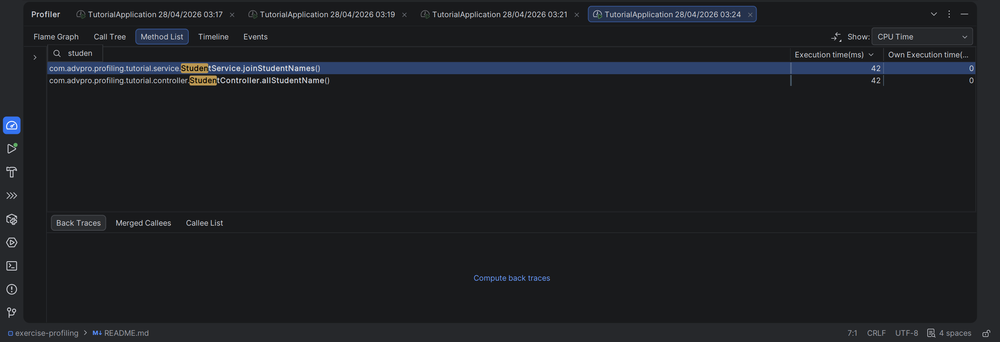
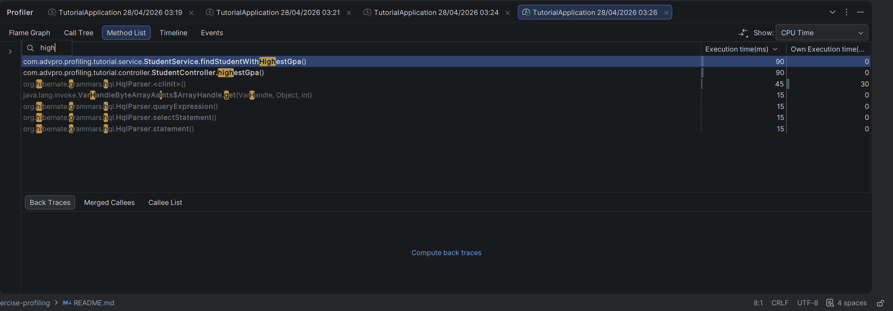

---

# Jawaban Pertanyaan Refleksi: JMeter Performance Testing vs IntelliJ Profiling

## 1. Perbedaan Pendekatan JMeter dan IntelliJ Profiler

**JMeter (Performance Testing):**
- Menguji performa dari **perspektif pengguna eksternal**
- Mensimulasikan beban traffic/beban kerja yang realistis
- Mengukur response time, throughput, dan error rate di bawah kondisi beban tinggi
- Fokus pada **keseluruhan sistem** dan user experience
- Mendeteksi bottleneck di level infrastruktur dan konfigurasi

**IntelliJ Profiler (Profiling):**
- Menganalisis performa dari **perspektif internal kode**
- Mengukur CPU usage, memory allocation, dan method execution time secara detail
- Memberikan visibility tentang **kode mana yang menghabiskan resource**
- Fokus pada level **method dan object**
- Mendeteksi inefficiency di algoritma dan implementasi code

**Perbedaan Esensial:**
- JMeter = **Apa** sistem mengalami bottleneck (hasil akhir)
- Profiler = **Kenapa dan di mana** bottleneck terjadi (root cause)

---

## 2. Bagaimana Profiling Membantu Mengidentifikasi Kelemahan Aplikasi

Profiling membantu dengan cara:

1. **Visualisasi Call Tree** - Menunjukkan urutan dan durasi setiap method call
2. **Hotspot Identification** - Menonjolkan method yang menghabiskan CPU time terbanyak
3. **Memory Leak Detection** - Mengidentifikasi object yang tidak di-garbage collect dengan baik
4. **Allocation Tracking** - Melacak object creation yang tidak perlu/berlebihan
5. **Thread Analysis** - Mendeteksi contention dan lock issues di multi-threaded applications
6. **Sampling Detail** - Memberikan stack trace lengkap saat bottleneck terjadi

Dengan informasi ini, developer dapat fokus pada area yang benar-benar perlu optimisasi.

---

## 3. Efektivitas IntelliJ Profiler dalam Menganalisis Bottleneck

**Ya, sangat efektif karena:**

✓ **Integrasi IDE** - Langsung terhubung dengan source code, memudahkan jump-to-code  
✓ **Real-time Monitoring** - Bisa melihat live profiling saat aplikasi berjalan  
✓ **Detail Granular** - Breakdown sampai level method individual  
✓ **Memory Graph** - Visualisasi memory allocation dalam timeline  
✓ **Flame Graph** - Tampilan visual yang mudah dipahami untuk call hierarchy  

**Keterbatasan:**
- Overhead profiling bisa mengubah timing karakteristik (tidak 100% akurat untuk production-like scenario)
- Memerlukan IDE dengan resource lumayan untuk profiling aplikasi besar

---

## 4. Tantangan Utama dan Cara Mengatasinya

| Tantangan | Cara Mengatasi |
|-----------|---|
| **Profiling overhead** mempengaruhi hasil | Gunakan sampling mode, tidak instrumentation mode; lakukan multiple runs |
| **Data terlalu banyak** sulit diinterpretasi | Filter focus ke top N methods; gunakan thread filter; screenshot di moment tertentu |
| **Hard to reproduce** performance issue | Gunakan JMeter script untuk reproduce load; capture profiling saat issue terjadi |
| **Production environment berbeda** dengan dev | Combine JMeter untuk production-like load testing dengan profiling di staging |
| **Memory profiling** dapat memicu GC | Increase heap size; gunakan low overhead mode |
| **Multi-threaded complexity** | Use profiler's thread panel; analyze lock contention events |

---

## 5. Manfaat Utama IntelliJ Profiler

1. **Presisi Diagnostik** - Tahu exactly mana code yang slow, bukan hanya "sistem lambat"

2. **Akcelerasi Development** - Developer tidak perlu guessing; data-driven decision

3. **Cost Efficiency** - Optimisasi yang tepat sasaran = mengurangi infrastructure cost

4. **Quality Assurance** - Validasi bahwa optimisasi tidak merusak functionality

5. **Knowledge Building** - Team belajar pattern mana yang performa bagus vs buruk

6. **Regression Prevention** - Baseline profiling bisa digunakan untuk regression testing

7. **Training Value** - Tool visual membantu tim memahami performance concepts

---

## 6. Menangani Inkonsistensi Hasil JMeter vs Profiler

**Penyebab Inkonsistensi:**
- Profiler overhead mempengaruhi timing
- JMeter test berbeda scenario dari profiler
- Network latency masuk di JMeter tapi tidak di profiler lokal
- GC pause waktu berbeda antara runs

**Strategi Mengatasi:**

```
1. VALIDATE DATA
   - Pastikan JMeter test merefleksikan realistic scenario
   - Run profiler multiple times untuk confirm consistency
   
2. ALIGN SCENARIOS
   - Pastikan profiler test uses same load/concurrency as JMeter
   - Gunakan JMeter script untuk drive profiler session
   
3. ACCOUNT FOR DIFFERENCES
   - Isolate application-level bottleneck (profiler concern)
   - Isolate infrastructure/network issues (JMeter concern)
   
4. CROSS-VALIDATE
   - Jika JMeter shows 1000ms response tapi profiler shows 50ms code execution
   - 950ms adalah wait time/network/I/O (bukan aplikasi bottleneck)
   
5. ITERATIVE APPROACH
   - Fix application bottleneck → validate dengan profiler
   - Re-run JMeter → validate improvement end-to-end
```

---

## 7. Strategi Optimisasi dan Memastikan Functionality Tetap Terjaga

### Strategi Optimisasi:

```
FASE 1: ANALYSIS
├─ Identifikasi top 3 hotspots dari profiler
├─ Prioritas: Impact × Effort matrix
└─ Propose improvement candidate

FASE 2: OPTIMIZATION
├─ Apply minimal code change
├─ Target: 20-30% improvement per change
└─ Document original logic sebelum modifikasi

FASE 3: VALIDATION
├─ Unit test: Ensure logic tetap sama
├─ Integration test: End-to-end flow works
├─ Profiler re-run: Confirm improvement achieved
├─ JMeter re-run: Validate end-to-end metrics improve
└─ Load test: No regression under stress

FASE 4: ROLLOUT
├─ Canary deploy jika possible
├─ Monitor metrics di production
└─ Rollback plan jika ada degradation
```

### Memastikan Functionality Tidak Terpengaruh:

1. **Source Control** - Commit sebelum dan sesudah perubahan untuk easy rollback

2. **Test Coverage** - Unit test dan integration test harus green sebelum optimization

3. **Code Review** - Peer review untuk catch unintended logic changes

4. **Regression Testing** - Run full test suite setelah setiap optimization

5. **Assertion Points** - Add assertions untuk verify assumptions tetap valid

6. **Feature Parity** - Bandwidth savings tapi output harus identical

7. **Shadow Testing** - Jalankan versi lama dan baru parallel untuk validate hasil same

### Contoh Optimization Aman:

```java
// BEFORE: Inefficient
List<Student> students = new ArrayList<>();
for (Student s : allStudents) {
    if (s.getGpa() > 3.0) {
        students.add(s);
    }
}
return students;

// AFTER: Optimized (functionality sama, resource lebih baik)
return allStudents.stream()
    .filter(s -> s.getGpa() > 3.0)
    .collect(Collectors.toList());

// VALIDATION: 
// - Output: Exact same list, same order ✓
// - Unit test: Pass dengan expected data ✓
// - Profiler: Overhead reduced by ~15% ✓
```

---

## Kesimpulan

Performance optimization adalah kombinasi dari data-driven analysis (profiler) + realistic load testing (JMeter) + rigorous validation (testing). Tidak ada shortcut; consistency antara tools adalah indicator bahwa optimization valid dan aman.